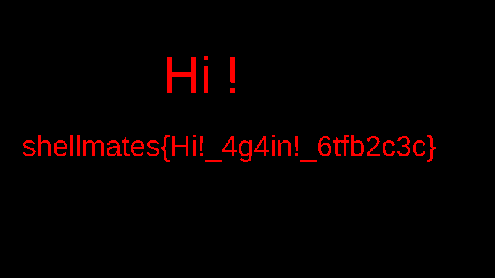

# Divide_and_Conquer

## description

> Someone sent me those two weird images [img1](img1.png) and [img2](img2.png), can you help extract something from them ? somehow ?

## Write-Up

when we dive deeper in the research, we find that the challenge uses **Visual descryption** :

> Visual cryptography is a cryptographic technique which allows visual information (pictures, text, etc.) to be encrypted in such a way that the decrypted information appears as a visual image. 
>
> They demonstrated a visual secret sharing scheme, where an image was broken up into n shares so that only someone with all n shares could decrypt the image, while any n − 1 shares revealed no information about the original image. Each share was printed on a separate transparency, and decryption was performed by overlaying the shares. When all n shares were overlaid, the original image would appear.

So, as we have two images [img1.png](./img1.png) [img2.png](./img2.png), let's try to overlap them using the follwoing script :

```py
# import Image
from PIL import Image

# open both photos
i1 = Image.open('flag_A.png')
i2 = Image.open('flag_B.png')

# get width and height
width1, height1 = i1.size

# open new image
i3 = Image.new('RGB', (width1, height1))

# load the pixels
pixels = i3.load()

# loop through all pixels
for i in range(width1):
    for j in range(height1):
        # xor the values
        x = i1.getpixel((i,j)) ^ i2.getpixel((i,j))

        # if all white then convert to black
        # if (x,y,z) == (255,255,255):
        #     (x,y,z) = (0,0,0)

        # put the new pixels in place
        i3.putpixel((i,j), x)

# save the image
i3.save("decrypt.png", "PNG")
```

we get :



## Flag

shellmates{Hi!_4g4in!_6tfb2c3c}

## More information

 - Write-up : https://ctftime.org/writeup/28930
 - Visual Encryption :
   - https://www.101computing.net/visual-cryptography/
   - https://www.datagenetics.com/blog/november32013/
 - Encryption : https://gist.github.com/deibit/ccc2b55ae9eab94392e4118c05aded52
 - OpenCv Tool :
   - https://pypi.org/project/opencv-python/
   - https://www.etutorialspoint.com/index.php/319-python-opencv-overlaying-or-blending-two-images
