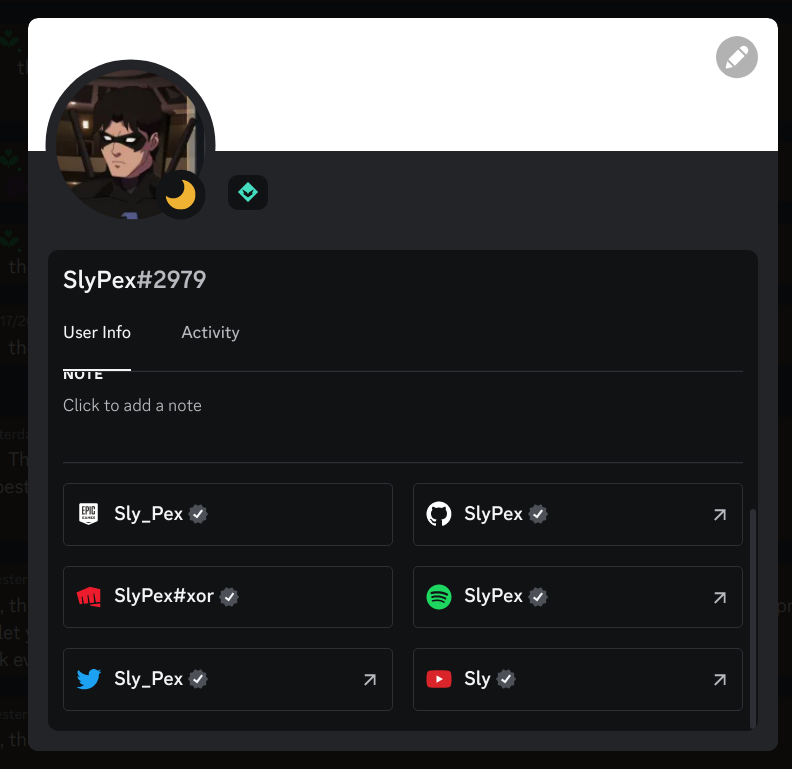
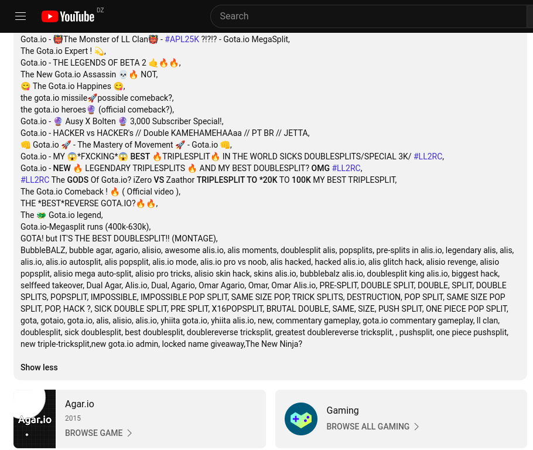

# G0t_A_IO

## Write-up

The challenge description says that:

```php
Just some old memories between Me and @niiirvox
```

it gave us a username `@niiirvox` and it says `Me` which is the author `SlyPex` we can get the author’s accounts from his discord profile.



After checking sevral social medias we found in twitter a tweet and a reply between `@niiirvox` and  `@Sly_Pex` which contains the following


So apparently the old memories is about a game which they played together and they made a lot of skins, they gave us some useful informations on how to solve the challenge

They gave us :

1. The skin name is `shellmates` and since it’s named like that it surely containes something related to the challenge
2. How to get the skin is by finding the discord server of the game.

Now we have to find what’s the game and since we have no clue we have to do more osint about `@SlyPex` and `@niiirvox`.

Moving to more platformes and we found something interesting in the author’s youtube channel throught his accounts from discord.


A video from 4 years ago which pretty old and looks like a game.
The video itself doesn’t contain anything interesting unlike it’s description where we can notice two things



1. The word `[Gota.io](http://Gota.io)` repeated too many time it may be the name of the game
2. The game may be `[Agar.io](http://Agar.io)` Cause youtube detected it.

There’s only one thing can confirm what is the game we’re looking for which is the challenge’s name `G0t_A_IO`. when we comapre it to the word we found it in the description of the video they’re alike, so it’s high likely to be the game we’re looking for.

Here’s their website and we can notice the discord icon in the top right corner.


Let’s hop in their discord server looking for the skin.


Moving around in their discord server we can find the `#skin` channel


The description of the channel says to use `/skin` to view skins , it must be a command to check skins.
let’s try `/skin shellmates`:


And there’s the skin we’re looking for.

## Flag

`shellmates{y0U_7rUely_g0T_$0M3_0S1NT_$k1ll$}`
