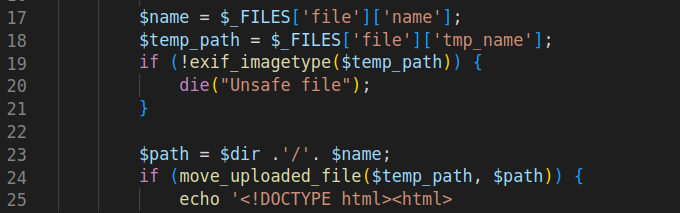

# Upload 1

## Write-up

The source code is also provided for this challenge, we see that we have the same PHP web application with the same upload feature, besides, this time, a check has been added:

By looking at the PHP documentation, we find that `exif_imagetype` function reads first bytes of the input file and returns the numeric value corresponding to the file type according to the table given below in the documentation

Good news are that this function only looks to first bytes.
So, our uploaded file has to:
- pass the check => first bytes of the file has to be same as one of the valid images specified in the table above.
- and be a valid php source code file so that apache executes it, so that we can get our RCE.  

One way to proceed is to make our file a valid GIF image, by adding the magic bytes of GIF format to our file and make it look a GIF for `exif_imagetype`.

## Exploit
We Upload a file named `x.php` starting with following magic bytes: `GIF89a` 
    followed by the our PHP code:
```php 
<?php passthru($_GET['cmd']); ?>
```
the file containing the payload is given [here](./shell.php).

